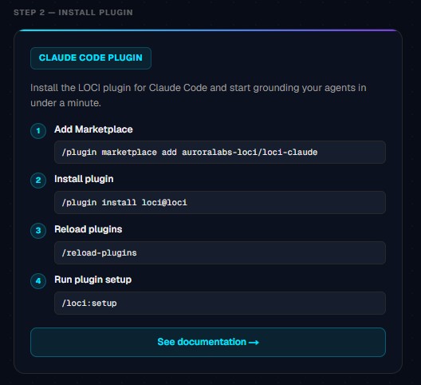

# Authorizing LOCI in Claude Code

This guide walks you through signing in to LOCI and installing the plugin in Claude Code so you can run firmware timing, energy, stack, and memory analysis on your projects.

---

## Before you begin

You will need:

- **Claude Code** installed and signed in.
- A **LOCI account** — a free tier is available; you can sign up during Step 1 if you don't have one yet.
- A compiled firmware binary (`.elf`, `.o`, or `.axf` file) — LOCI reads compiled artifacts, not source code.

---

## Step 1 — Sign in to your LOCI account

Go to the LOCI portal and sign in with your email and password, or continue with Google. If you're new to LOCI, use **Get started free — no card needed** instead.

<!-- TODO: insert screenshot — "Welcome to LOCI" sign-in panel -->


---

## Step 2 — Install the LOCI plugin in Claude Code

From the same welcome screen (or any time after signing in), run these four commands in Claude Code:

```
/plugin marketplace add auroralabs-loci/loci-claude
/plugin install loci@loci
/reload-plugins
/loci:setup
```

<!-- TODO: insert screenshot — "Claude Code Plugin" install panel, same screen as Step 1 -->


`/loci:setup` installs the `loci` CLI and verifies your environment — see [README — Install](../README.md#install) for prerequisites (Python, `uv`, `jq`, a cross-compiler).

---

## Step 3 — Authenticate the CLI

Every LOCI analysis skill requires a signed-in session. Run:

```
loci login
```

in your terminal, and follow the prompt to sign in with the same LOCI account you used in Step 1. Confirm it worked:

```
loci auth status
```

should report `signed_in`.

---

## Step 4 — Verify LOCI is ready

Run `/help` in Claude Code:

```
/help
```

This shows your current environment status, available skills, and quota — confirming everything is wired up.

---

## Troubleshooting

| What you see | Likely cause | Fix |
|---|---|---|
| A skill reports `auth_required` | Not signed in to the CLI | Run `loci login`, then confirm `loci auth status` shows `signed_in` |
| `loci: command not found` | CLI not installed yet | Run `/loci:setup` to install and verify — it's idempotent and repairs whatever's missing |
| `Daily token limit reached` | Free-tier quota consumed for the day | Wait for the reset window shown in the error, or upgrade your plan |

Skills that work signed-out: `/help`, `/loci:setup`, `/bug-report`.
Skills that need sign-in: `exec-trace`, `stack-depth`, `memory-report`, `control-flow`, `trends`, `loci-preflight`, `loci-post-edit`.

For build-environment or cross-compiler issues, see [README — Troubleshooting](../README.md#troubleshooting).

---

## Next steps

With LOCI signed in and installed, you can run any of its skills from Claude Code:

- `/exec-trace` — timing and energy from real workloads and platform traces.
- `/stack-depth` — worst-case stack depth analysis.
- `/memory-report` — ROM/RAM breakdown from your ELF file.
- `/control-flow` — annotated CFG for a function.
- `/trends` — per-function measurement history on the current branch.

Two skills also run automatically without a slash command:

- **loci-preflight** — triggered during `/plan` when you describe new logic.
- **loci-post-edit** — triggered immediately after you edit a C/C++/Rust source file.

See the [LOCI skills reference](../skills/) for details on each skill.
